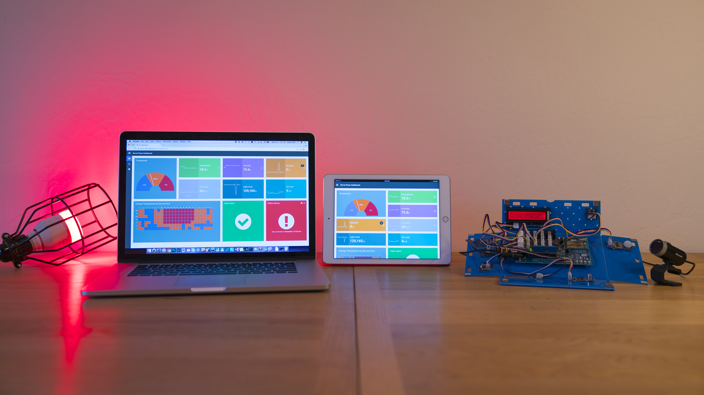
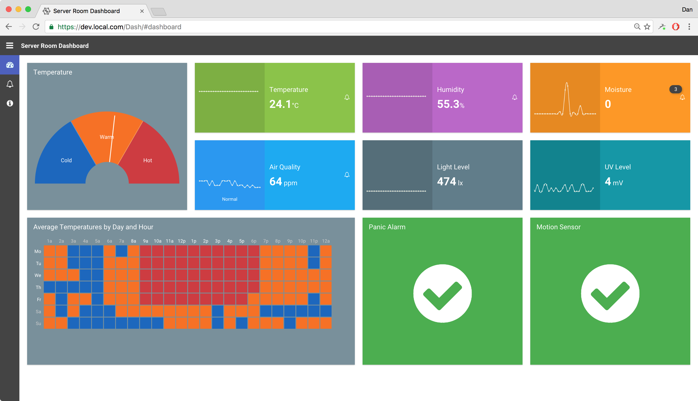
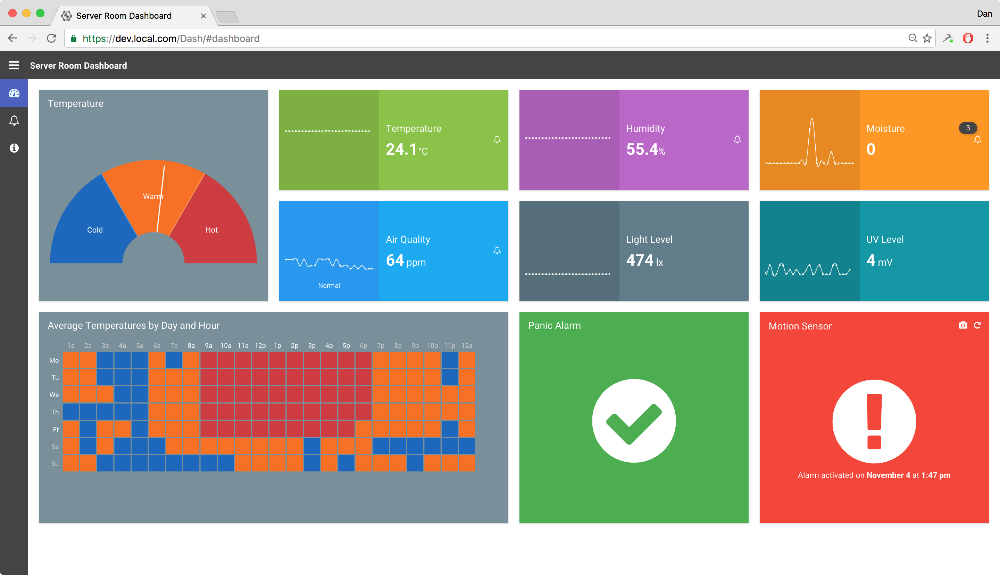
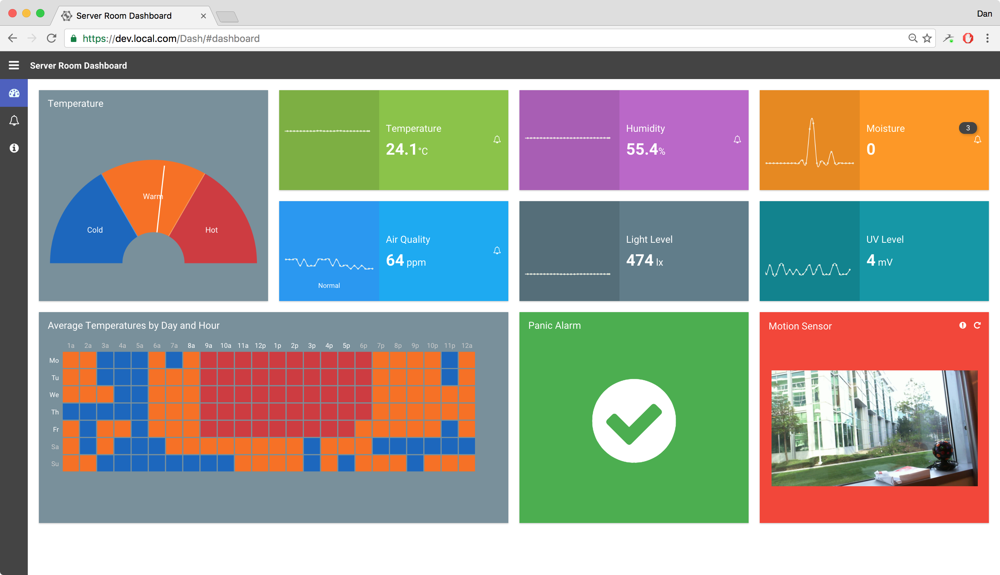
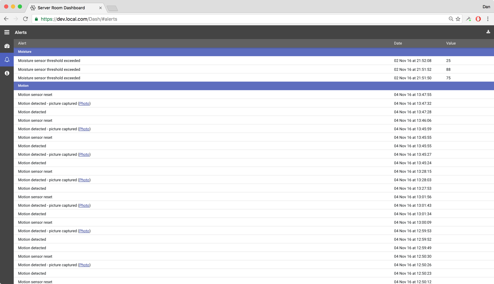
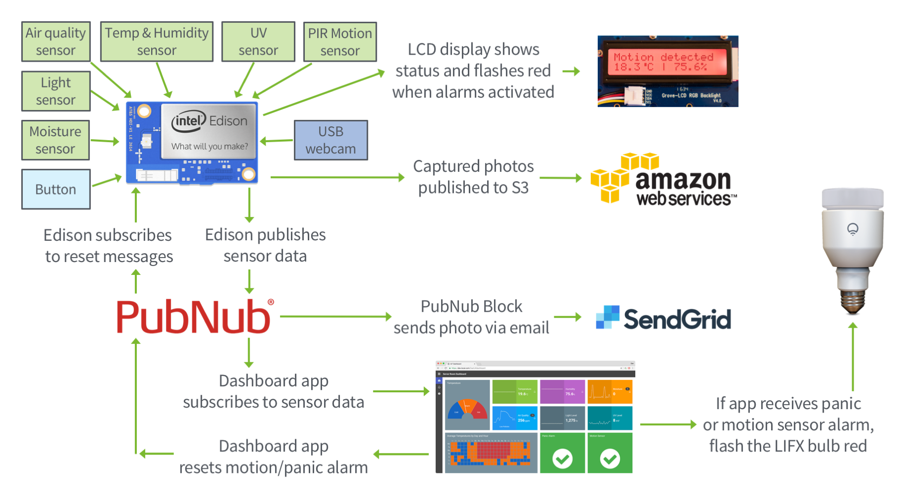

# IoT Dashboard App

This Server Room monitoring app, built using Sencha Ext JS 6.2 Premium, and demonstrated
at [SenchaCon 2016](https://www.senchacon.com) in Las Vegas, showcases how to 
create an Internet of Things (IoT) dashboard app that displays a live stream of 
sensor data delivered by an Intel Edison device, with various sensors connected.

An Intel Edison device has been programmed with a custom Node.js app that reads 
sensor values at a set interval, and leverages [PubNub](https://www.pubnub.com) to
publish live sensor data for the Ext JS dashboard to summarize and react upon.

Also connected to the Edison device is a USB webcam. This is used for capturing an 
image whenever the PIR motion sensor is activated.

The Ext JS Modern toolkit is being used for the app, along with the Material Design 
theme and colors from the [Google design guidelines](https://material.google.com/style/color.html).

The main purpose of the app was to showcase the ability to summarize streaming data 
using various Ext JS components (charts, custom panels and grids), along with being 
able to interact with IoT enabled devices. So rather than this app just visualizing 
data, it would also act upon the values. For example, whenever the panic button or 
motion sensor are activated, the Ext JS app issues an API call to flash a LIFX bulb 
red. So this demonstrates the ability of an Ext JS app to both visualize and interact 
with IoT devices.

The first screen shown when the app loads is the dashboard:

When the motion sensor is activated, this triggers the appropriate panel to
illustrate the alert:

The user can also view the photo captured by the webcam connected to the Intel 
Edison device:

All alerts are captured in the alerts grid, and can be exported to Excel by
clicking on the export button on the toolbar:

## Structure

This repository contains both the source code for the Ext JS client app, and the
Node.js app that runs on the Intel Edison device.

The diagram below illustrates how the app is structured, and the different 
technologies, services, and sensors being used.

## Security

There is no authentication implemented in this example app.  The client app just 
loads and immediately subscribes to PubNub messages.

The Publish and Subscribe keys for PubNub are specified in the app.json files in 
each of the respective projects. The API token for LIFX is also specified in the 
Ext JS application's app.json file.  In a real-world environment these keys would
be stored on the server-side, or the Ext JS app would be containerized using something
like Electron to secure the source.

## Notes

Due to time constraints, the D3 heatmap on the dashboard uses a static data file, 
but if this app were to be hooked up to a database for large amounts of historical 
analytical data, then real data could be used. Everything else in the dashboard 
is based off of live/real data.